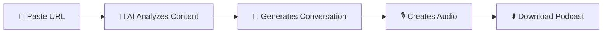

<div align="center">

# 🎙️ PodWise

### Transform Any URL Into a Professional AI Podcast

*Created by [Hima](https://github.com/yourusername)*

[](https://nextjs.org/)
[](https://www.typescriptlang.org/)
[](https://tailwindcss.com/)
[](https://opensource.org/licenses/MIT)

[Demo](https://podwise-demo.vercel.app) • [Documentation](https://docs.podwise.com) • [Report Bug](https://github.com/yourusername/podwise/issues) • [Request Feature](https://github.com/yourusername/podwise/issues)


</div>

---

## 🌟 What is PodWise?

PodWise is an **AI-powered podcast generator** that transforms any article, blog post, or web content into an engaging, professional-quality podcast conversation. Simply paste a URL, and watch as AI creates a natural dialogue between a host and guest, complete with realistic voices and professional audio production.

### ✨ Why PodWise?

- **🚀 Lightning Fast**: Generate podcasts in minutes, not hours
- **🤖 AI-Powered**: Intelligent conversations using Google Gemini
- **🎵 Studio Quality**: Multi-voice audio with Murf AI's premium voices
- **📱 Modern UX**: Beautiful, intuitive interface with smooth animations
- **🔄 Fully Customizable**: Adjust voices, tone, and conversation style

---

## 🎯 Key Features

<table>
<tr>
<td width="50%">

### 📄 Smart Content Extraction
- Scrapes and analyzes any URL
- Extracts key points and insights
- Cleans and structures content automatically

</td>
<td width="50%">

### 🤖 Natural Conversations
- AI-generated host-guest dialogues
- Context-aware responses
- Engaging storytelling format

</td>
</tr>
<tr>
<td width="50%">

### 🎵 Professional Audio
- Multiple voice options (Male & Female)
- High-quality text-to-speech
- Seamless audio transitions

</td>
<td width="50%">

### ⚡ Real-Time Processing
- Parallel audio generation
- Progress tracking
- Instant regeneration options

</td>
</tr>
</table>

---

## 🎬 How It Works



1. **Enter a URL** - Paste any article or blog link
2. **AI Magic** - Watch as Gemini AI crafts an engaging conversation
3. **Voice Selection** - Choose from premium voice options
4. **Generate** - Sit back while we create your podcast
5. **Download** - Get your MP3 file ready to share

---

## 🚀 Quick Start

### Prerequisites

Make sure you have the following installed:
- Node.js 18+ 
- npm or yarn
- Murf AI API key ([Get one here](https://murf.ai))
- Google Gemini API key ([Get one here](https://makersuite.google.com/app/apikey))

### Installation

```bash
# Clone the repository
git clone https://github.com/yourusername/podwise.git
cd podwise

# Install dependencies
npm install

# Set up environment variables
cp .env.example .env.local
```

Add your API keys to `.env.local`:

```env
MURF_API_KEY=your_murf_api_key_here
GEMINI_API_KEY=your_gemini_api_key_here
```

```bash
# Run the development server
npm run dev
```

🎉 Open [http://localhost:3000](http://localhost:3000) and start creating!

---

## 🏗️ Architecture

```
┌─────────────────────────────────────────────────────────────┐
│                         Frontend Layer                       │
│  (Next.js 14, TypeScript, Tailwind, Framer Motion)         │
└────────────────────┬────────────────────────────────────────┘
                     │
┌────────────────────▼────────────────────────────────────────┐
│                       API Routes Layer                       │
│         • /api/generate-script - Script Generation          │
│         • /api/generate-audio - Audio Processing            │
└────────────────────┬────────────────────────────────────────┘
                     │
┌────────────────────▼────────────────────────────────────────┐
│                      Services Layer                          │
│  ┌──────────────┐  ┌──────────────┐  ┌──────────────┐     │
│  │ Gemini AI    │  │  Murf TTS    │  │Content Scrape│     │
│  │ Service      │  │  Service     │  │  Service     │     │
│  └──────────────┘  └──────────────┘  └──────────────┘     │
└─────────────────────────────────────────────────────────────┘
```

---

## 📁 Project Structure

```
podwise/
├── 📱 app/
│   ├── (main)/
│   │   ├── components/          # React components
│   │   │   ├── UrlInput.tsx    # URL input component
│   │   │   ├── AudioPlayer.tsx # Audio playback
│   │   │   └── AudioGen.tsx    # Audio generation UI
│   │   └── page.tsx            # Main application page
│   └── api/                     # API routes
│       ├── generate-script/    # AI script generation
│       └── generate-audio/     # Audio synthesis
├── 🔧 services/
│   ├── gemini.service.ts       # Gemini AI integration
│   ├── murf.ts                 # Murf TTS integration
│   └── contentScraping.ts      # Web scraping logic
├── 🛠️ utils/
│   ├── voicePack.ts            # Voice configurations
│   └── debug-utils/            # Debugging utilities
└── 💬 prompts/
    └── podcastPrompt.ts        # AI conversation templates
```

---

## 🎨 Customization

### Voice Options

Customize available voices in `utils/voicePack.ts`:

```typescript
export const voicePack = [
  { voiceId: "en-IN-isha", displayName: "Isha (F)" },
  { voiceId: "en-IN-eashwar", displayName: "Eashwar (M)" },
  { voiceId: "en-US-jessica", displayName: "Jessica (F)" },
  // Add more voices...
];
```

### Conversation Style

Adjust the AI's conversation style in `prompts/podcastPrompt.ts`:

```typescript
export const podcastPrompt = `
Create an engaging podcast conversation with:
- Natural, flowing dialogue
- Thoughtful questions and insights
- Professional yet friendly tone
- Clear explanations of complex topics
`;
```

---

## 🚀 Roadmap

### 🎯 Phase 1: Performance & Scale (Q2 2024)
- [ ] Redis/RabbitMQ message queues
- [ ] Kafka integration for large conversations
- [ ] Background job processing
- [ ] CDN integration for global delivery
- [ ] Horizontal scaling support

### 🎯 Phase 2: Enhanced Features (Q3 2024)
- [ ] PostgreSQL database integration
- [ ] User authentication & libraries
- [ ] Advanced audio editor
- [ ] Real-time collaboration
- [ ] Podcast analytics dashboard

### 🎯 Phase 3: Real-Time & Interactive (Q4 2024)
- [ ] Live podcast creation
- [ ] WebSocket-based streaming
- [ ] Interactive audience features
- [ ] Real-time transcription
- [ ] Voice command controls

### 🎯 Phase 4: AI Evolution (Q1 2025)
- [ ] Custom AI model training
- [ ] Emotion detection & modulation
- [ ] Multi-language support
- [ ] Automatic music insertion
- [ ] Audio quality enhancement

### 🎯 Phase 5: Platform Expansion (Q2 2025)
- [ ] Mobile app (React Native)
- [ ] Public API for integrations
- [ ] White-label solutions
- [ ] Enterprise features
- [ ] Advanced analytics

---

## 🛠️ Tech Stack

<div align="center">

| Category | Technologies |
|----------|-------------|
| **Frontend** | Next.js 14, TypeScript, Tailwind CSS, Framer Motion |
| **AI Services** | Google Gemini, Murf AI |
| **Audio Processing** | Node.js Audio Buffers, MP3 Encoding |
| **Deployment** | Vercel, Edge Functions |

</div>

---

## 📊 Performance

- ⚡ **Average Generation Time**: 30-60 seconds
- 🎵 **Audio Quality**: 320kbps MP3
- 📝 **Conversation Length**: Up to 50 messages
- 🌐 **Supported Languages**: English (more coming soon)

---

## 🤝 Contributing

Contributions make the open-source community an amazing place to learn, inspire, and create. Any contributions you make are **greatly appreciated**!

1. Fork the Project
2. Create your Feature Branch (`git checkout -b feature/AmazingFeature`)
3. Commit your Changes (`git commit -m 'Add some AmazingFeature'`)
4. Push to the Branch (`git push origin feature/AmazingFeature`)
5. Open a Pull Request

See [CONTRIBUTING.md](CONTRIBUTING.md) for detailed guidelines.

---

## 📝 License

Distributed under the MIT License. See `LICENSE` for more information.

---

## 🙏 Acknowledgments

Special thanks to these amazing technologies and services:

- [Murf AI](https://murf.ai) - Premium text-to-speech voices
- [Google Gemini](https://deepmind.google/technologies/gemini/) - Intelligent conversation generation
- [Next.js](https://nextjs.org) - The React framework for production
- [Tailwind CSS](https://tailwindcss.com) - Utility-first CSS framework
- [Vercel](https://vercel.com) - Deployment and hosting platform

---

## 📞 Get in Touch

<div align="center">

**Hima** - Project Creator

[](https://github.com/yourusername)
[](https://linkedin.com/in/yourusername)
[](https://twitter.com/yourusername)
[](mailto:support@podwise.com)

**Project Link**: [https://github.com/yourusername/podwise](https://github.com/yourusername/podwise)

</div>

---

<div align="center">

### ⭐ Star us on GitHub — it motivates us a lot!

Made with ❤️ by [Hima](https://github.com/yourusername)

*Transform any content into engaging podcasts with the power of AI*

</div>
