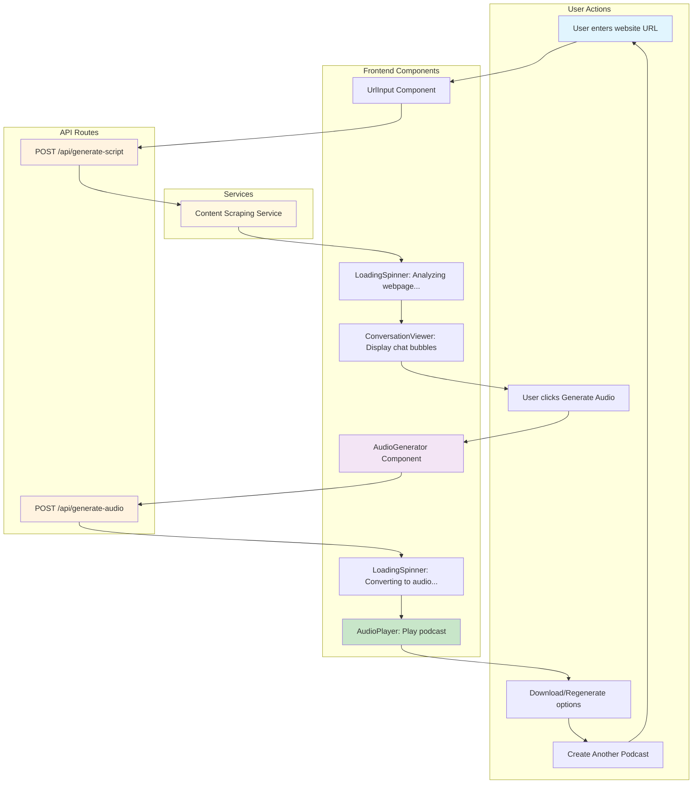
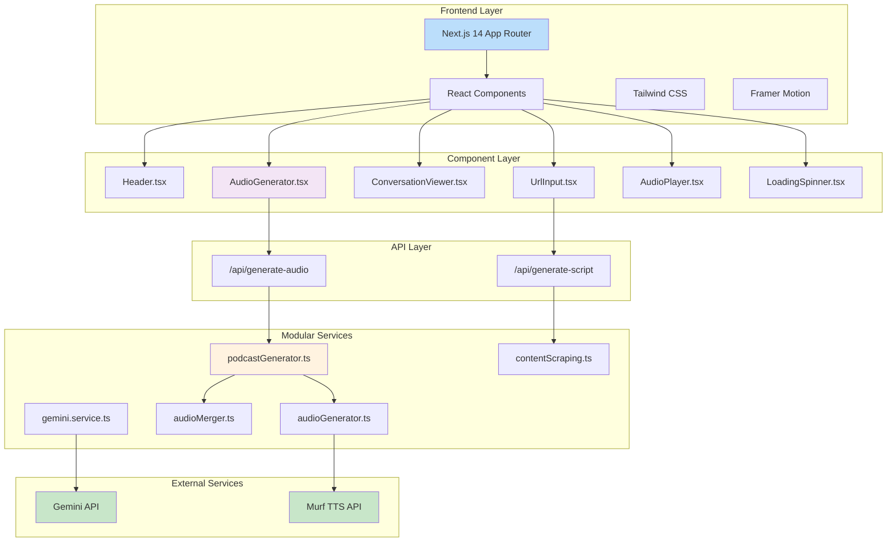
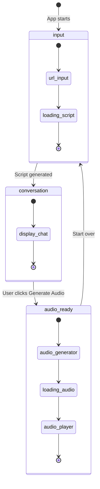
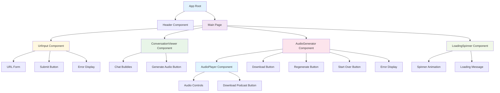
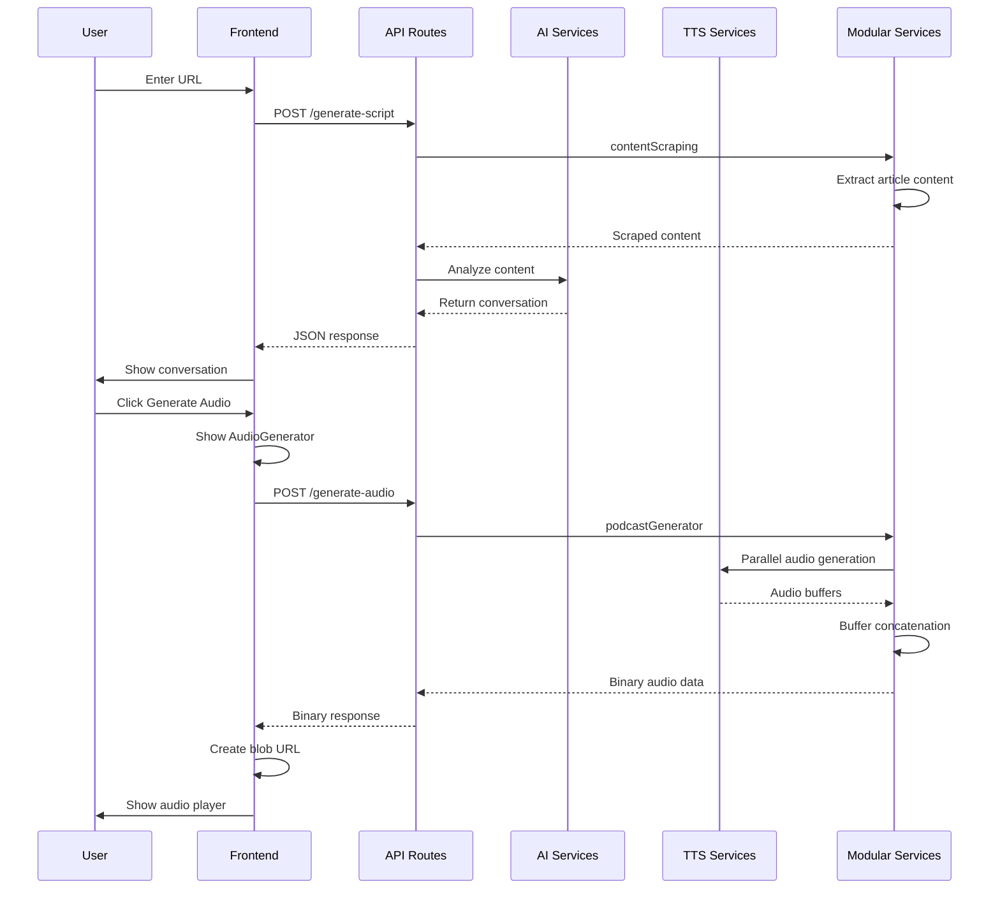

# 🎙️ PodWise Application Flow Diagram

## 🏗️ Architecture Overview

## 🔄 State Management Flow

## 🧩 Component Hierarchy

## 📊 Data Flow

## 🎯 Key Features

- **Modern UI**: Gradient backgrounds, smooth animations
- **Responsive Design**: Works on all devices
- **Real-time Feedback**: Loading states and progress indicators
- **Multi-Voice Audio**: Different voices for host and guest
- **Audio Controls**: Play, pause, download, regenerate
- **Error Handling**: Comprehensive error messages and recovery
- **State Management**: Clean flow between app states
- **TypeScript**: Full type safety
- **Modular Architecture**: Reusable and maintainable services
- **Binary Audio Processing**: Efficient audio generation and streaming
- **Parallel Processing**: Fast audio generation for multiple messages
